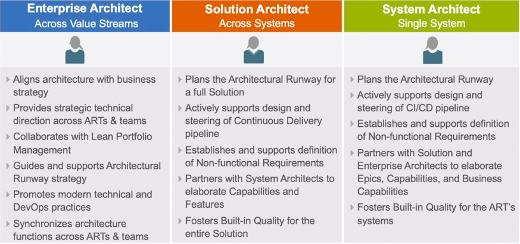
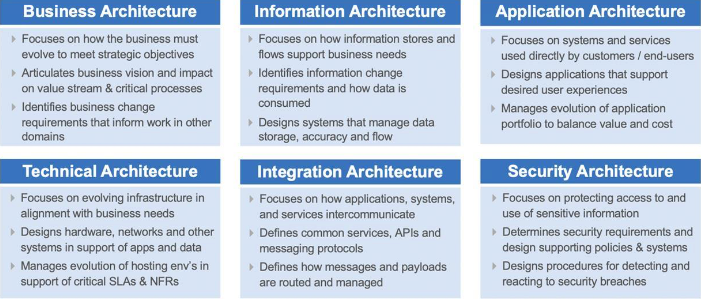
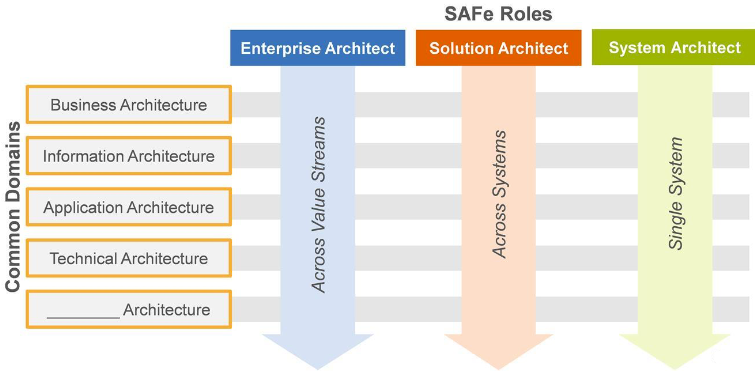
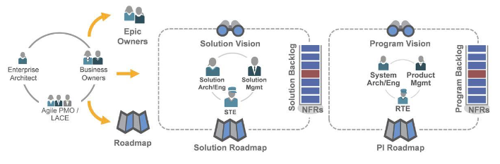

# Exemplifying Agile Architecture

[TOC]

## Learning Objectives

1) Describe Agile architecture

2) Describe SAFe Architect roles and collaborations

3) Architect using SAFe principles

## Traditional architecture definitions

**ANSI/IEEE**: The fundamental organization of a system, embodied in its components, their relationships to each other and the environment, and the principles governing its design and evolution.

**ISO/IEC/IEEE**: Fundamental concepts or properties of a system in its environment embodied in its elements, relationships, and in the principles of its design and evolution.

## Agile architecture

SAFe defines Agile architecture as a set of values and practices that support the active evolution of the design and architecture of a system while implementing new system capabilities.

Agile architecture:

* Evolves systems over time while supporting needs of current users
* Avoids overhead and delays associated with phase-gated processes 
* Ensures systems always run
* Supports the continuous flow of value
* Balances intentional architecture and emergent design

## SAFe Architecture roles and collaborations

* Enterprise Architect
* Solution Architect
* System Architect

Common Architecture domains

SAFe Architect roles span domains

Architect Collaboration

## Architecting using SAFe Principles

*“The impression that ‘our problems are different’ is a common disease that afflicts management the world over. They are different, to be sure, but the principles that will help to improve the quality of product and service are universal in nature.”*

—W. Edwards Deming

1. Take an economic view.
2. Apply systems thinking.
3. Assume variability; preserve options.
4. Build incrementally with fast, integrated learning cycles.
5. Base milestones on objective evaluation of working systems.
6. Visualize and limit Work In Process (WIP), reduce batch sizes, and manage queue lengths.
7. Apply cadence; synchronize with cross-domain planning.
8. Unlock the motivation of knowledge workers.
9. Decentralize decision-making.
10. Organize around value.

### 1. Take an economic view

Every SAFe portfolio requires an economic framework—a set of decision guidelines that align everyone with the financial objectives of a portfolio and inform the decision-making process

SAFe’s economic framework contains these four primary elements:

- **Operating within Lean budgets and guardrails**. These guardrails include guiding investments by horizon, optimizing value and solution integrity with capacity allocation, approving significant initiatives (portfolio epics), and continuous business owner engagement.
- ***Understanding economic trade-offs***. Everyone involved in building solutions needs to understand the trade-offs between development expense, lead time, product cost, value, and risk. Changing any one of these five variables can have an impact on one or more of the others. Understanding how each variable influences the others is vital to making good decisions.
- **Leveraging suppliers**. Outsourcing labor can provide a cost-efficient way to add personnel, especially if the need is temporary or the demand is highly variable. A supplier may provide specific hardware, software, or skills needed for the solution.
- **Sequencing jobs for the maximum benefit**. In a flow-based system, job sequencing, rather than prioritization based on speculative return on investment, produces the best economic outcome. To that end, Weighted Shortest Job First (WSJF) is used to prioritize backlogs by calculating the relative Cost of Delay (CoD) and job duration.

**Read more --**> https://v5.scaledagileframework.com/take-an-economic-view/

### 2. Apply systems thinking.

SAFe highlights the important role economics plays in successful solution development. Therefore, SAFe’s first Lean-Agile principle is to take an economic view. It is Principle #1 for a reason: if the solution doesn’t meet the customer’s or systems builder’s economic goals, then the long-term viability of the solution is suspect. Solutions fail for many reasons, and failed economics is a primary culprit.

**Read more -->** https://v5.scaledagileframework.com/take-an-economic-view/

### 3. Assume variability; preserve options.

Systems builders have a natural inclination to try to reduce variability. It just seems that the more you think you know and have already decided, the further along than you think you are. But this is often not the case. While it is true that variability can lead to bad outcomes, the opposite case can also be true. Variability is not inherently bad or good. Rather, it is the economics associated with the timing and type of variability that determines the outcomes. 

**Read more -->** https://v5.scaledagileframework.com/assume-variability-preserve-options/

### 4. Build incrementally with fast, integrated learning cycles.

In traditional, stage-gated development, investment cost begins immediately and accumulates until a solution is delivered. Often, there is little to no actual value delivered until all of the committed features are available, or the program runs out of time or money. During development, it is difficult to get any meaningful feedback because the process isn’t designed for it, and the system isn’t designed or implemented to permit incremental capabilities to be evaluated by the customer.

**Read more -->** https://v5.scaledagileframework.com/build-incrementally-with-fast-integrated-learning-cycles/

### 5. Base milestones on objective evaluation of working systems.

The development of today’s large systems requires substantial investment, which can reach millions, tens of millions, and even hundreds of millions of US dollars. Together, systems builders and customers have a fiduciary responsibility to ensure that the investment in new solutions will deliver the necessary economic benefit. Otherwise, there is no reason to make the investment.

**Read more -->** https://v5.scaledagileframework.com/base-milestones-on-objective-evaluation-of-working-systems/

### 6. Visualize and limit Work In Process (WIP), reduce batch sizes, and manage queue lengths.

Overloading teams and programs with more work than they can accomplish is a common and pernicious problem. Having too much work-in- process (WIP) in the system causes multiplexing and frequent context switching. It overloads the people doing the work, reduces focus on any task at hand, reduces productivity and throughput, and increases wait times for new functionality.

**Read more -->** https://v5.scaledagileframework.com/visualize-and-limit-wip-reduce-batch-sizes-and-manage-queue-lengths/

### 7. Apply cadence; synchronize with cross-domain planning.

Cadence provides a rhythmic pattern, the dependable heartbeat of the process. Cadence makes routine that which can be routine, so the intellectual capacity of knowledge workers can be devoted to managing the variable parameters. Cadence transforms unpredictable events into predictable ones and has many additional benefits.

**Read more -->** [Apply cadence synchronize with corss domain planning](https://v5.scaledagileframework.com/apply-cadence-synchronize-with-cross-domain-planning/)

### 8. Unlock the motivation of knowledge workers.

The knowledge worker is able to communicate across functional boundaries, make decisions based upon an understanding of the economics, achieve fast feedback as to the efficacy of their solution, participate in continuous, incremental learning and mastery, and more generally participate in a more productive and fulfilling solution development process. That is one of the most powerful motivations of all.

**Read more -->** [Unlock the intrinsic motivation of knowledge workers](https://v5.scaledagileframework.com/unlock-the-intrinsic-motivation-of-knowledge-workers/)

### 9. Decentralize decision-making.

Delivering value in the shortest sustainable lead time requires decentralized decision-making. Any decision that must be escalated to higher levels of authority introduces a delay in delivery. In addition, escalated decisions can decrease decision fidelity due to the lack of local context plus changes to fact patterns that occur during the waiting period.

**Read more -->** https://v5.scaledagileframework.com/decentralize-decision-making/

### 10. Organize around value.

Many enterprises today are organized around principles developed during the last century. In the name of intended efficiency, most are organized around functional expertise. But in the digital age, the only sustainable competitive advantage is the speed with which an organization can respond to the needs of its customers with new and innovative solutions. These solutions require cooperation amongst all the functional areas with their incumbent dependencies, handoffs, waste, and delays. Instead, Business Agility demands that enterprises organize around value to deliver more quickly. And when market and customer demands change, the enterprise must quickly and seamlessly reorganize around that new value flow.

**Read more -->** [Oranize around value](https://v5.scaledagileframework.com/organize-around-value/)

## Leason Review 

In this lesson you:

* Explored the concept of Agile architecture.
* Explored SAFe roles related to architecture.
* Discovered how SAFe principles impact architecture.

Read more --> [Agile Architecture](https://v5.scaledagileframework.com/agile-architecture/) 

