# Architecting for DevOps and Release on Demand

[TOC]

## Learning objectives:

1. Foster a DevOps culture
2. Describe how value flows through the Continuous Delivery Pipeline
3. Architect for and facilitate Continuous Exploration
4. Architect for Continuous Integration
5. Architect for Continuous Deployment
6. Architect for Release on Demand

## Foster a DevOps culture

### What is DevOps?

* DevOps is a combination of two words, development and operations.
* It is a mindset, a culture, and a set of technical practices.
* It provides communication, integration, automation, and close cooperation among all the people needed to plan, develop, test, deploy, release, and maintain a Solution.
* It is part of the Agile Product Delivery competency of the Lean Enterprise.

### A CALMR approach to DevOps

* <u>**C**</u>ulture - Establish a culture of shared responsibility for development , deployment , and operations .
* <u>**A**</u>utomation - Automate the Continuous Delivery Pipeline.
* <u>**L**</u>ean flow - Keep batch sizes small , limit WIP,and provide extreme visibility.
* <u>**M**</u>easurement- Measure the flow through the pipeline . Implement full-stack telemetry .
* <u>**R**</u>ecovery -Architect and enable low-risk releases. Establish fast recovery, fast reversion, and fast fix-forward.

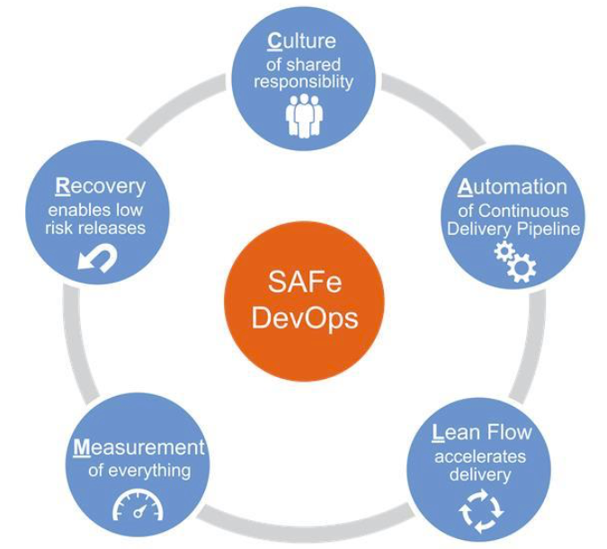

[SAFe CALMR](https://v5.scaledagileframework.com/devops/)

### The Architect's role in fostering a DevOps mindset

* Architect Solutions for continuous value flow
* Participate in design and execution of the Continuous Delivery Pipeline
* Bridge communications between business, development, and operations
* Automate architectural compliance checks
* Evangelize and exemplify CALMR principles

## Describe how value flows through the Continuous Delivery Pipeline

### The Continuous Delivery Pipeline (CDP)

* continuos exploration
* continuos integration
* continuos deployment

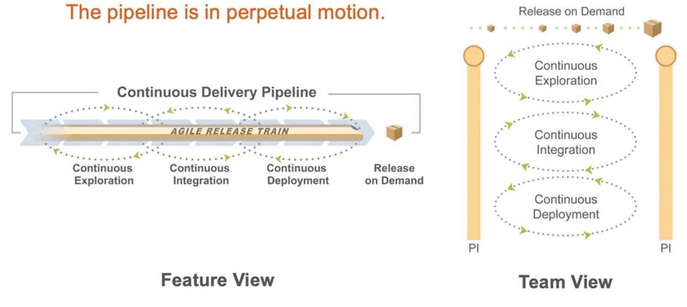

### The DevOps health radar

* continuos exploration
* continuos integration
* continuos deployment
* release on demand

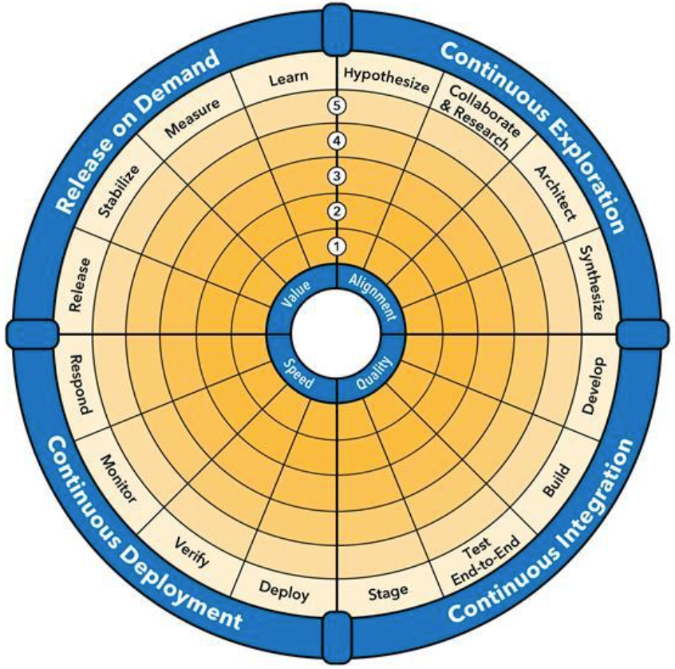

The work that Architects do in Continuous Exploration impacts the entire pipeline, ... and Architects are needed at every step of delivery to ensure continuous flow.

### Analyse value flow with value stream mapping

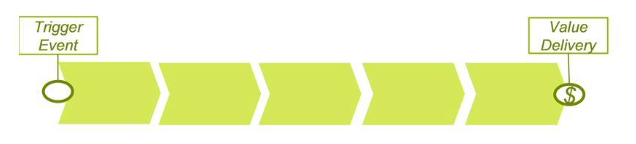

* Visualize steps in the end-to-end delivery process
* Understand how value flows through the organization
* Measure delivery efficiency and identify bottlenecks
* Locate the real root causes of delivery problems
* Define and prioritize process improvements

### Architecture greatly impacts value flow

**Common flow impediments **
Big design up front
Architecture review boards
Ivory towers
Monolithic systems
Architecture as documentation
Architecture silos

**Common flow enablers**
Minimum viable architecture
Automated compliance checks
Continuous collaboration 
Loosely coupled systems
Architecture as code
Federated architecture

### Improve flow with Enablers

* There are four types of enablers
  * Explartion
  * architectural
  * infrastructure
  * compliance
* Enablers are managed in the backlogs. Enablers should be
  * estimated
  * prioritized
  * work in process (WIP) limits
  * Capacity allocation

## Architect for and facilitate Continuous Exploration

### Continuous Exploration

* Business perspective
  * Understand Customer needs and achieve alignment on desired business outcomes across the organization.
* IT perpective
  * Quickly define highest value delivery path and prepare backlogs for implementation
* Architecture perspective
  * Align to MVPs(Minimum Viable Product) and MMFs (Minimum Marketable Feature)
  * Contribute to backlogs and prioritization

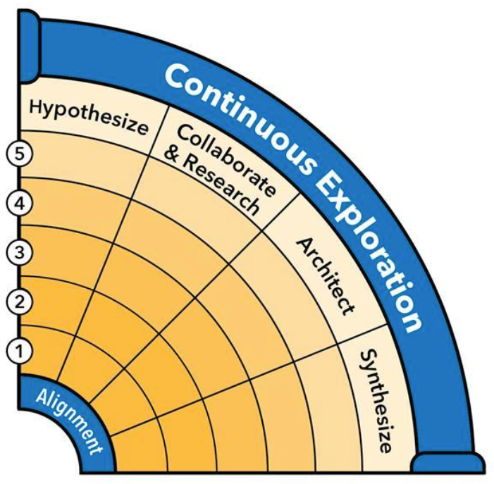

### Align to MVPs and MMFs

* A minimum viable product (MVP) is the minimum feature set required to test a business hypothesis
* Minimum marketable features (MMFs) comprise an MVP
* **Architectural considerations**
  * Architect for fast business outcomes
  * Define Architectural Runway
  * Define minimum viable architecture
  * Apply domain-driven design (DOD)
  * Define nonfunctional requirements (NFRs)

### Contribute to backlogs and prioritization

If it's not in the backlog, it won't gt done (even architecture)
$$
WSJF = Cost.of.delay / job.duration (Job.size)
$$

**Architectural considerations**

* Write Enabler Epics, Capabilities , and Features
* Add value to business Epics , Capabilities , and Features
* Write NFRs as backlog items or acceptance criteria
* Prioritize the backlog using WSJF
* Write architecture requirements as executable tests

Given _________________

When ____________________

Then ____________________

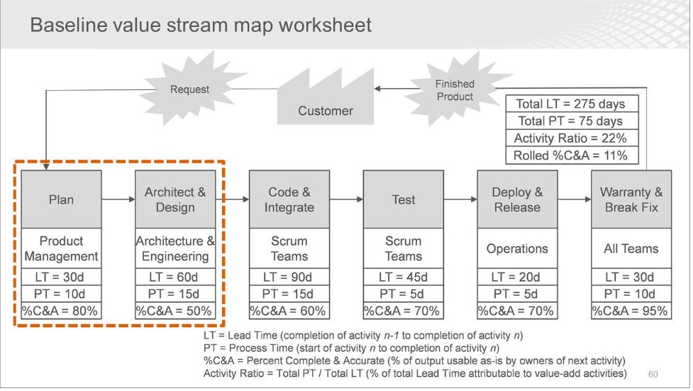

**LT** = Lead time (completion of activity n-1 to completion of activity n)

**PT** = process time (start of activity n to completion of activity n)

**%C&A** = percentage complete & Accurate (% of output usable as-is by owners of next activity)

**Activity Ratio** = tocal PT / toatl LT (% of total lead time attributable to value-added activities)

## Architect for Continuous Integration

### Continuous Integration

* Business perspective
  * Ensure products function properly so that value can be realized
* IT perspective
  * Reduce cost and risk of deferring quality issues 
* Architecture perspective
  * Architect for Continuous Integration 
  * Architect for continuous testing 
  * Automate the deployment pipeline
  * Automate compliance

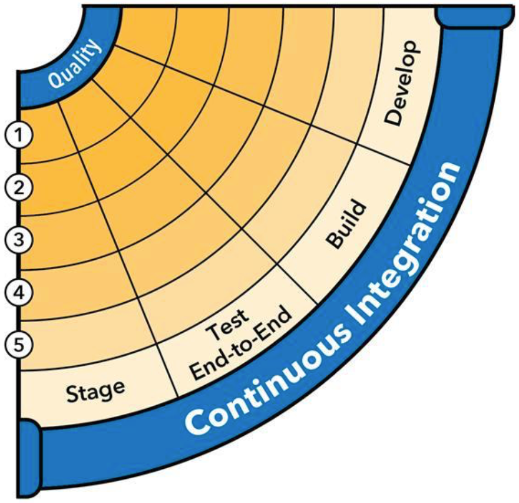

### Architect for Continuous Integration

* Enable multiple, daily clean builds per developer
* Minimize code branching and hard dependencies

* **Architectural considerations**
  * Loosely coupled systems
  * Version control
  * Cl & Gated commits
  * Trunk-based development
  * Automated architecture validation

### Architect for continuous testing

* In a system designed for testability, all jobs require less time
* Test continuously and demo working software at least every increment
* **Architectural considerations**
  * Loosely-coupled systems
  * Test automation
  * Test data management
  * Service virtualization
  * Stubs , mocks , and test doubles

[Read more on SAFe Continuous Integration](https://v5.scaledagileframework.com/design-for-testability-a-vital-aspect-of-the-system-architect-role-in-safe/)

### Automate the deployment pipeline

* Strive to automate all steps **from commit to deploy**
* This significantly accelerates and reduces the delivery process risk
* **Architectural considerations**
  * Cl/CD toolchain and productivitytool integration
  * Pipeline orchestration Version control
  * Build dashboards ChatOps tools

### Automate Compliance

* Manual compliance reviews can severely impede flow
* Automate compliance steps to speed delivery and reduce risk
* **Architectural considerations**
  * Architecture test automation
  * Automated approvals
  * Static code analysis
  * Security vulnerability scanning
  * Requirements and change traceability

## Architect for Continuous Deployment

### Continuous Deployment

* Business perspective
  * Features are ready to be launched when market timing is optimal
* IT perspective
  * Features get all the way to 'done' on a continuous basis
* Architecture perspective
  * Continuous deployment to production
  * Decouple deployment from release
  * Full stack telemetry
  * Rapid recovery from production issues

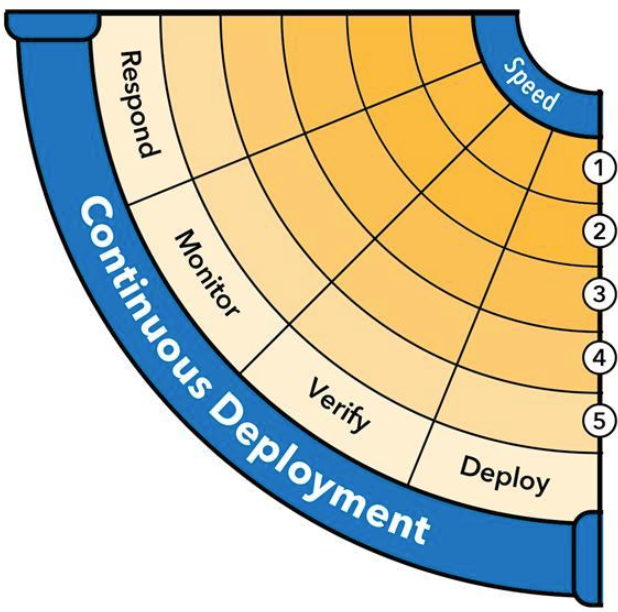

* Always be deploying to production
* The goal is a *fully automated process from code commit to deploy*
* **Architectural considerations**
  * Deployment automation
  * One-click deploys
  * Infrastructure as code
  * Deployment self-service
  * Ubiquitous version control

[Read more on SAFe Release on Demand](https://v5.scaledagileframework.com/release-on-demand/)

### Full-stack telemetry

* To inform fact-based decision-making, we need proper data
* **Architectural considerations**
  * Applications should clearly log and report meaningful activities and events
  * Architect applications and infrastructure to support telemetry
  * Monitor both technical and business data
  * Federate/aggregate the monitoring infrastructure

### Architect for recoverability

* Quickly and elegantly restore Solutions to stable states
  * MTTR([Mean time to repair](https://en.wikipedia.org/wiki/Mean_time_to_repair)) is a leading indicator of organizational maturity
* Architectural considerations
  * Automated rollback
  * Rapid fix-forward (never circumvent the pipeline)
  * Immutable infrastructure
  * Failure rehearsal and self-sabotage (e.g., Chaos Monkey)
  * Containerization
  * Sanctity of version control

## Architect for Release on Demand

### Release on Demand

* Business perspective
  * Leverage technology to run and grow the business
* IT perspective
  * Provide valuable and reliable business Solutions
* **Architecture perspective**
  * Release on Demand
  * Decouple release elements
  * Architect for operations
  * Measure business value delivered

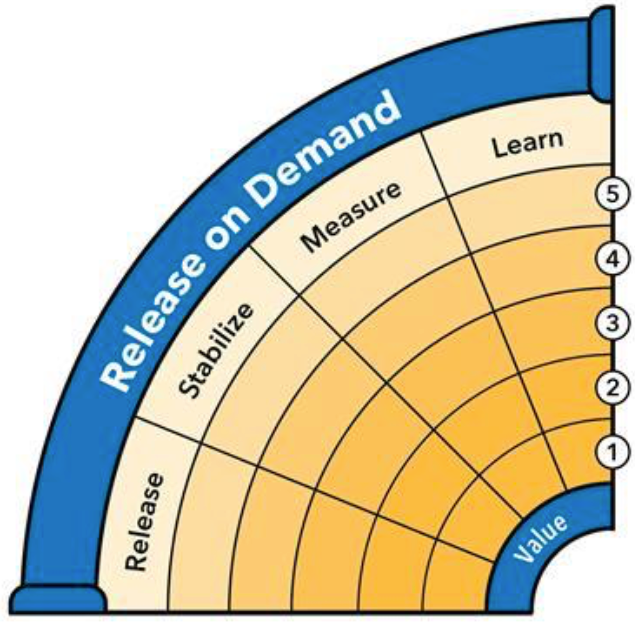

* Expose 'dark' features to Customers based on market readiness
* Releasing should be low risk, instantaneous, and reversible
* **Architectural considerations**
  * Blue/green infrastructure
  * Canary releases
  * Feature toggles
  * A/B testing

### Decouple release elements

* Different parts of the Solution may require different release strategies
* Architect the Solution to support the needs of all Customers
* Architect sub-systems for independent build, test, deploy, and release

### Architect for operations

* Operational integrity is the foundation of business value
  * Defined by NFRs,SLAs,BCPs,and QoS agreements

* **Architectural considerations**
  * Proactive issue detection and notification
  * Elastic infrastructure and auto-scaling
  * Failover and DR (Chaos Monkey style)
  * Intrusion detection
  * Full stack monitoring and logging

### Measuring business value

* Determining value delivered is critical to evaluate hypotheses and analyze qualitative and quantitative feedback
* **Architectural considerations**
  * System performance analytics
  * User behavior/experience analytics
  * Bl systems , dashboards & reports
  * Full stack telemetry
  *  Retrospectives & Inspect and Adapt sessions

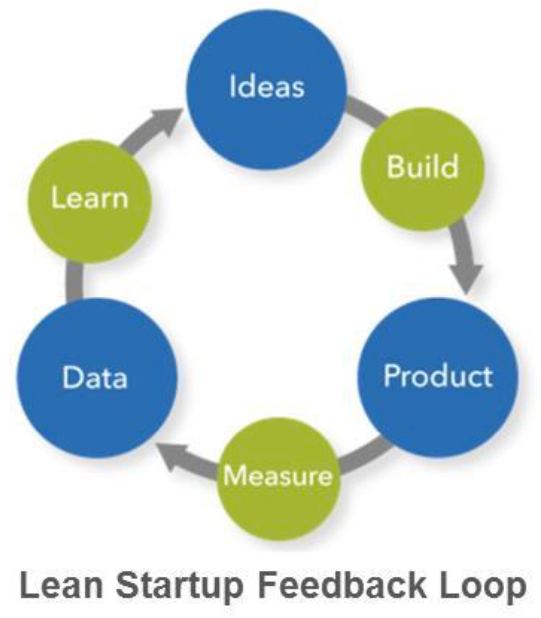

## Lesson Review

In this lesson you:

* Explored ways Architects can foster a DevOps culture
* Explored how value flows through the Continuous Delivery Pipeline
* Explored how to architect for and facilitate Continuous Exploration
* Explored architecting for Continuous Integration
* Explored architecting for Continuous Deployment
* Explored architecting for Release on Demand

# Architecture Considerations for Devops

## Continuous Exploration

### Architect for and facilitate continuos exploration

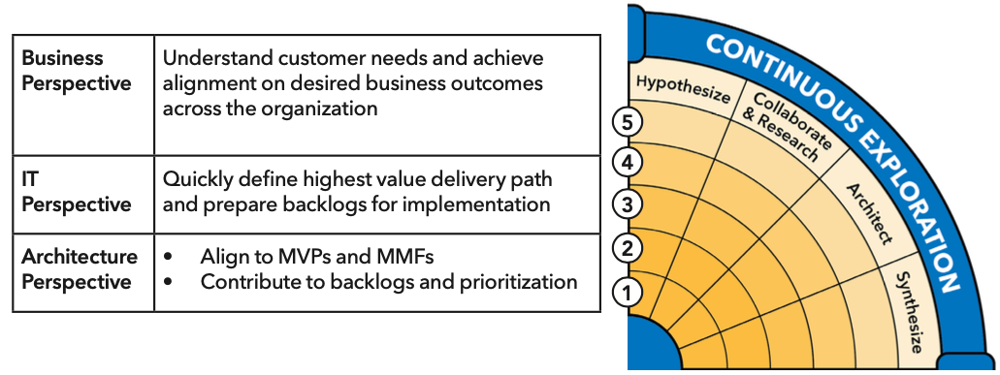

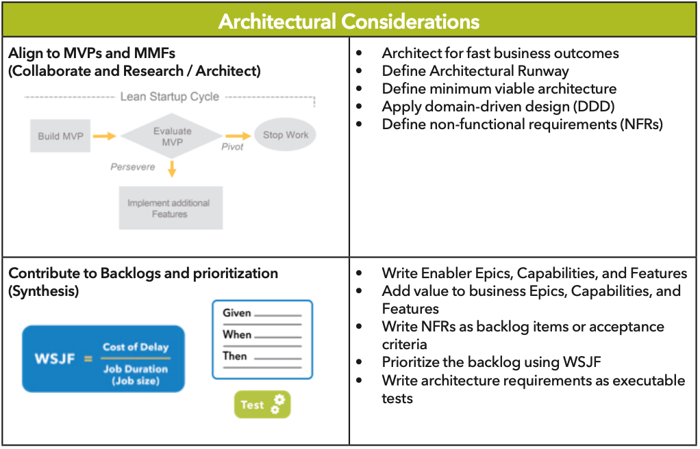

## Continuous Integration

### Architect for Continuous Integration

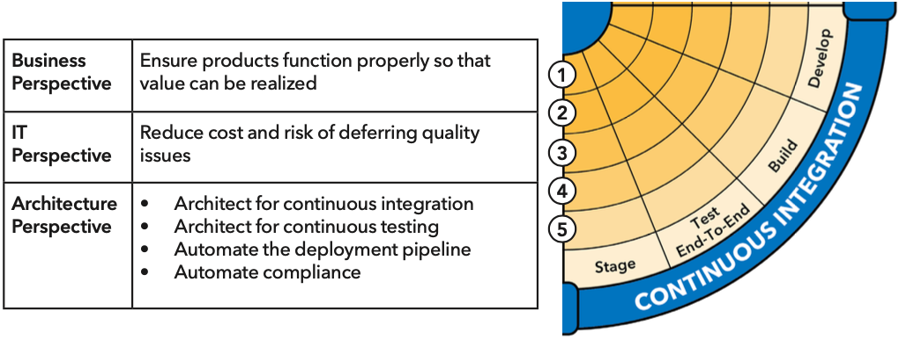

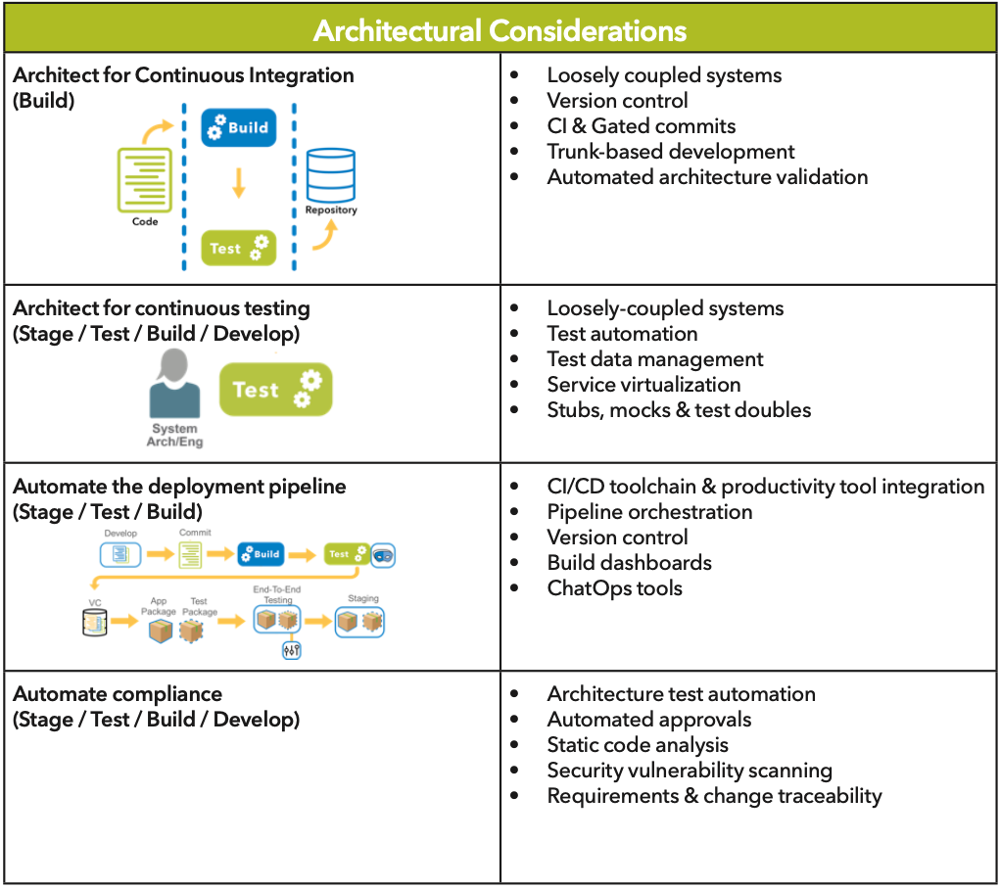

## Continuous Deployment

### Architect for Continuous Deployment

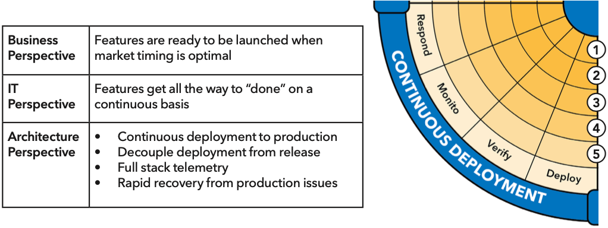

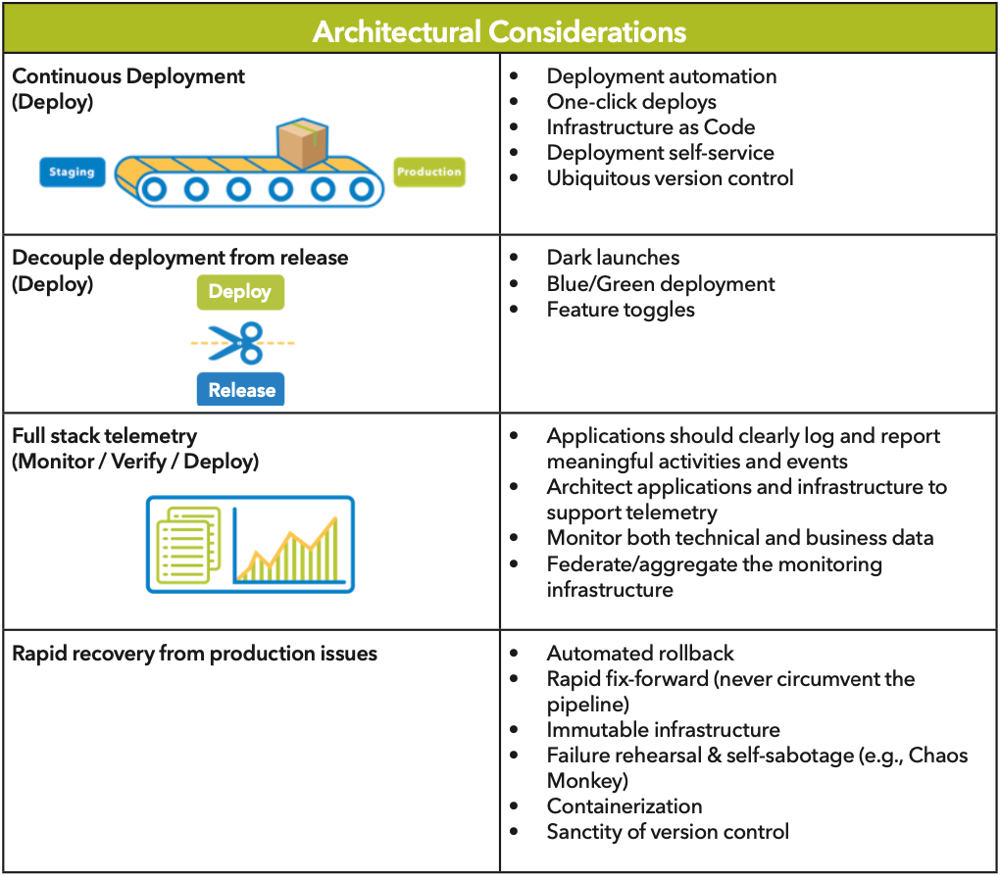

## Release on Demand

### Architect for Release on Demand

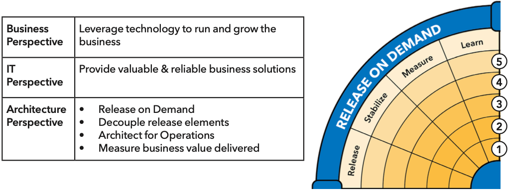

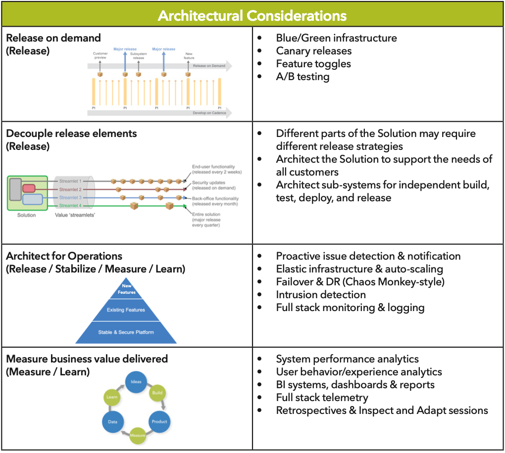

