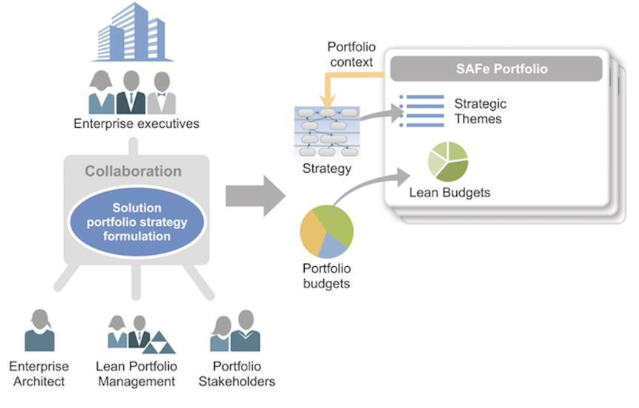
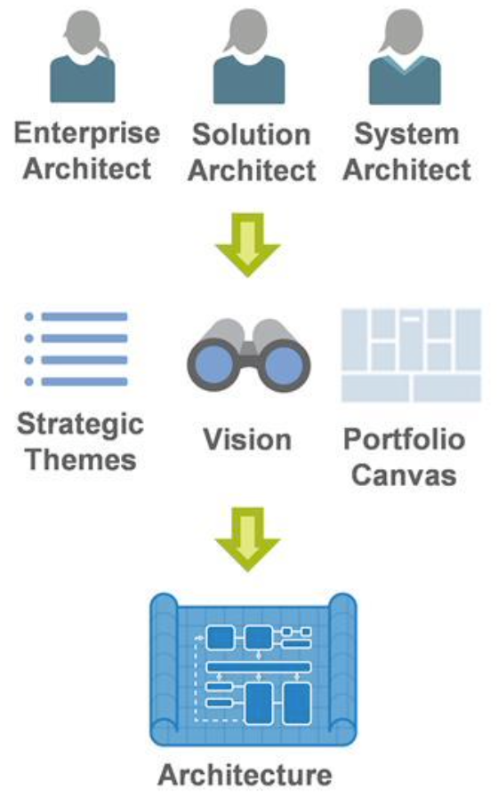
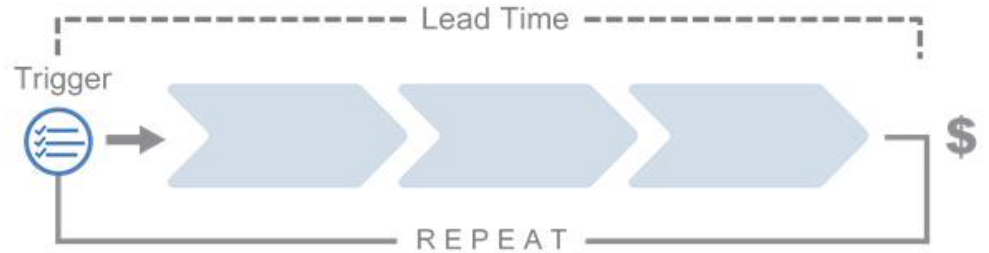
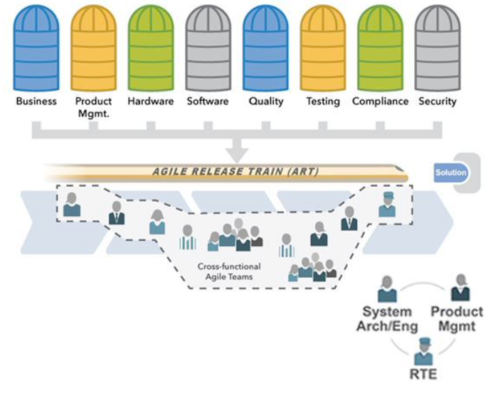
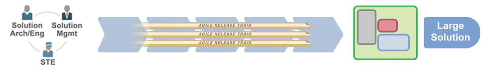

# ALIGNING Architecture with Business Value

[TOC]

## Learning Objectives:

1. Describe how Strategic Themes, portfolio canvas, and Portfolio Vision influence architecture
2. Explain how Value Streams support the business
3. Explain how Solution Trains and Agile Release Trains deliver value

## What are Strategic Themes?

* Differentiating business objectives that connect a portfolio to Enterprise strategy.
* Primary purpose is to drive portfolio innovation and differentiation.

## Describe how Strategic Themes, portfolio canvas, and Portfolio Vision influence architecture

### Strategic Themes are developed collaboratively

### What is a portfolio canvas?

* The *portfolio canvas* is a business model canvas adapted to charter and describe the structure and purpose of a SAFe Portfolio.
* It describes how a portfolio of Solutions creates, delivers, and captures value for an organization.
* It helps define and align the portfolio 's Value Streams and Solutions to the goals of the Enterprise.

### What is a vision?

* Explains why we are doing what we're doing
* Provides a unifying 'why' for major decisions
  * Sets the direction for future work
  * Ensures teams are aligned on a shared goal
  * Allows teams and individuals to make localized decisions
* Can serve as a key decision-support tool
* There are Visions at different levels (Vision is on the spanning palette)

## Explain how Value Streams support the business

### What is a Value Stream?

* Value Streams represent the series of steps an organization uses to build Solutions that provide a continuous flow of value to a Customer.
* Value Streams:
  * Are used to define and realize portfolio-level business objectives and organize Agile Release Trains (ARTs) to deliver value more rapidly
  * Contain the people who do the work, the systems, and the flow of information and materials

* Operational Value Stream
  * deliver value to the customer.
* Development Value Stream
  * used to build the systems and capabilities that enable operational Value Stream.

## Explain how Solution Trains and Agile Release Trains deliver value

### What is a Solution?

* Each Value Stream produces one or more Solutions, which are products, services, or systems delivered to the Customer, whether internal or external to the Enterprise.
* A Solution may be a product, a product line, a set of systems, or a service that enables an operational Value Stream.

### What is an Agile Release Train (ART)?

* Virtual organization of 5 to 12 teams (50 to 125+ individuals)
* Has all the capabilities- software, hardware, firmware and other assets- needed to define , implement , test , and deploy new system functionality
* Operates with the goal of achieving continuous flow of value
* Synchronized on common cadence (a Program Increment)
* Aligned to common mission via Program Backlog

### What is a Solution Train?

* The Solution Train is the organizational construct used to build large and complex Solutions that require the coordination of multiple Agile Release Trains (ARTs) and Suppliers.
* It aligns ARTs with a shared business and technology mission using the Solution Vision, backlog, and Roadmap, and an aligned Program Increment (Pl).

### Suppliers role

* Suppliers play a key role in Large Solution development
* Provide unique value not available in Value Stream
* Can be internal (another portfolio or Value Stream within our portfolio) or external (another Enterprise)
* Lean-Agile Suppliers are treated as another ART, participating in all Solution Train events

## LESSON Review

In this lesson you:

* Discovered how Strategic Themes, portfolio canvas, and Portfolio Vision influence architecture
* Realized how Value Streams support the business
* Explored how Solution Trains and Agile Release Trains deliver value

