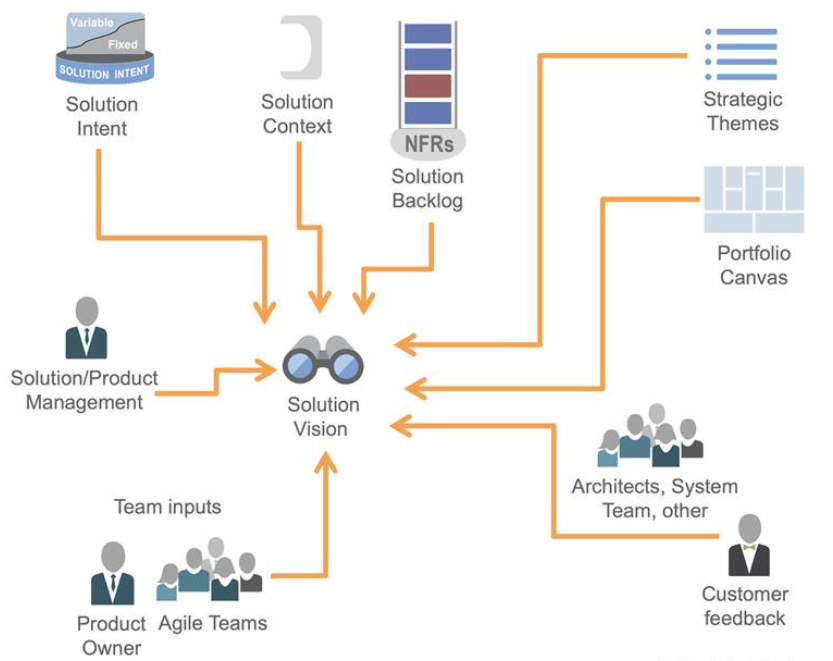

# Developing Solution Vision, Solution Intent, and Roadmaps

[TOC]

## Learning Objectives

* Align Solution Vision with Strategic Themes and Solution Context
* Contribute to Solution Intent
* Manage quality with nonfunctional requirements (NFRs) and the Lean quality management system (QMS)
* Contribute to Roadmaps

## Align Solution Vision with Strategic Themes and Solution Context

### Solution Vision

* Product and Solution Management translate the Portfolio Vision into a Solution Vision
* It defines the reason and direction behind the chosen Solution
* Solution Vision addresses questions to be asked and answered:
  * What will this new Solution do?
  * What problem will it solve?
  * What benefits will it provide?
  * For whom will it provide them?
  * What performance (nonfunctional requirements) will it deliver?

More on scaledagileframework.com

* [Solution](https://www.scaledagileframework.com/solution/)
* [Solution Train](https://www.scaledagileframework.com/solution-train/)

### Solution Context

* Solution Context is the environment in which the Solution operates
* Where will the solution be deployed and used/accessed? For example:
  * Public cloud
  * On-premise data center - Field hardware
  * Cyber-physical system
  * Influences functional and nonfunctional requirements

More on:

* [Solution Context](https://www.scaledagileframework.com/solution-context/)
* 

### Solution Context bounds the Solution

Solution Context strongly influences:

* Solution Vision
* Solution Intent
* Solution Backlog
* Nonfunctional requirements
* Continuous Delivery Pipeline flow
* Release on Demand timing

### Customer personas inform Solution Context

* **Merchant Persona**: My business markets and sells physical goods to retail consumers in my region. I need the ability to take orders for products I carry and deliver the orders using a reliable, secure , and cost-effective transportation service. It ll pick up parcels at my business's distribution points (warehouses , stores , or curbside loading zones) and drop them off at the recipient's location.
* **Recipient Persona**: I am a retail customer placing a delivery order to a local business. I want to receive the product within two hours of ordering it. While the order is processed and the package is in transit , I would like to receive status updates through a mobile app. The package must be secured so that I am the only one authorized to take delivery of it at the drop-off location.

## Contribute to Solution intent

### Solution Intent provides single source of truth

**Solution Intent** is the repository for storing , managing , and communicating the knowledge of current and intended Solution behavior.
**Solution Intent:**

* Records and communicates requirements , design , and system architecture decisions
* Facilitates continuous exploration and analysis activities
  Aligns the customer , Development Team , and Suppliers to a common purpose
* Supports compliance, contractual agreements, traceability, high assurance

More on:

* [Solution Intent](https://www.scaledagileframework.com/solution-intent/)

### Context diagram example

The context diagram defines what is in and out of scope for system and shows communication between system and external entities.

### Architecture

* Conceptual architecture
* Sequence diagram

### Collaborate to create Solution Intent
* Product and Solution Management, Solution Architects , and Systems Engineering are responsible for highest-level, system-wide decisions, including:
  * System decomposition
  * Interfaces
  * Traceability
  * Structure and organization
* Teams and Suppliers add context and detail

### Moving from variable to fixed Solution Intent
* Preserve flexibility to enable evolution towards optimum Solution
* Validate assumptions continuously through repetitive learning cycles (Program Increments)
* Drive exploration with Enablers
* Converge on well-defined (fixed) behaviors

### Architect for Change

* Identify areas of external uncertainty
  * Driven by volatility in **Solution Context**
* Identify known areas for high-impact changes of approach
  * Driven by volatility in **Solution Intent**
* Invest in changeability for these areas
  * After you identify the need to change, you'll have the least time
  * Make those areas easy to change quickly

## When in doubt, model it out

* A picture is worth a thousand words
* Sketch for communication, alignment, and to create shared understanding
* Describes system context, structure, behavior, data, etc.

### Model-based systems engineering (MBSE)

* Using a set of related models, define, design, simulate, and document a system under development
* Accelerate learning before the cost of change gets too high

### Minimum sufficient documentation
* Favor models over documents
* Keep Solution Intent **collaborative**
* Preserve options by deferring decisions to local concerns and making decisions as late as possible
* Document items only in one place-a single source of truth
* Keep it high level as those details change less frequently

## Manage quality with nonfunctional requirements and the Lean quality management system

### Nonfunctional requirements constrain system designs

* NFRs ensure the system meets usability, security, and other qualities
* Persistent constraints on backlog items are typically through the item's definition of done or acceptance criteria
* Implementing an NFR requires new backlog items that evolve the system to new constraints
* NFRs are often referred to as "-ilities"

More at:

* [Nonfunctional Requirements - NFRs](https://www.scaledagileframework.com/nonfunctional-requirements/)

More on [SAFe Requirement Model](https://www.scaledagileframework.com/safe-requirements-model/)

### Architecture evolves to support NFRs
By imposing constraints, NFRs often impact a wide range of system functionality. Therefore, they're an important factor to consider when:

* Analyzing business Epics, Capabilities, and Features
* Planning and building the Architectural Runway
* Refactoring to better reflect increasing Solution domain knowledge
* Imposing DevOps constraints on manufacturing, deployment, support, installation, maintainability, etc.

### Specifying NFRs
* Some NFRs must be implemented immediately (fixed).
  * All at once (e.g., change in regulatory requirement)
  * Incrementally (Story by Story):
    * As the result of selecting within variable Solution Intent
    * As part of shifting the Vision or Solution Intent
    * As part of discovering gaps in the Customer's expectations
* Trade-offs described in the economic framework impact the implementation approach. Implementation should occur in a way that will allow several learning cycles to determine the right level of NFR.

### Defining NFRs

Like all requirements, NFRs must be quantified for clarity.

### NFR Example: Reliability.Delivery.Predictability

* **Name**: Reliability.Delivery.Predictability
* **Scale**: Minutes between expected vehicle arrival time and actual arrival
* **Meter**: Average observed results per delivery from monitoring

### Lean QMS improves quality and compliance predictability

The Lean quality management system (QMS) is an approach or system for safe guarding high assurance in a high-risk,compliance-driven environment.

### Test automation builds quality and compliance in
* Give teams automated scripts instead of checklists.
* Automate compliance and NFR tests along with functional tests
* Include tests for security, scalability, performance, compliance, etc.

## Contribute to Roadmaps

### Plan at multiple levels
* Roadmaps define the path to achieve a Vision through a schedule of events and Milestones that communicate planned deliverables.
* Outer levels are less defined, less committed; inner levels are more near-term, defining well-understood and committed Solution behavior.

### Collaborating to create Roadmaps

Tight coordination is required to keep Roadmaps aligned to business priorities, aligned to each other, and connected to the work.

### Roadmaps are influenced by market behavior
* Market rhythms are cyclical and predictable
* Market events are ad-hoc

### A Solution Roadmap informs multiple Pl Roadmaps

* A Solution [Roadmap](https://www.scaledagileframework.com/roadmap/) typically forecasts work over multiple years
* Pl Road maps forecasts work over 3 - 4 Pis

### Roadmaps deliver Architectural Runway
* The [Architectural Runway](https://www.scaledagileframework.com/architectural-runway/) consists of **working components and infrastructure** that enable continuous delivery of business Features and functionality
* Example: A new API management system will enable Agile Teams to build Features with fewer code- level dependencies, less regression testing , and lower deployment risk

### Architectural Runway is a collaborative effort 

* To keep pace with the business, substantial runway is often needed
* Decentralize the effort to ensure runway evolves as needed
* [**Intentional architecture**](https://www.scaledagileframework.com/solution-intent/) - Specific guidelines produced by Architects that ensure the long-term performance and usability of Solutions
* **Emergent design** - Process by which Agile Teams extend and improve the architecture as needed to support Feature delivery
* A balance between intentional architecture and [emergent design](https://www.scaledagileframework.com/agile-architecture/) is required for speed of development and maintainability.

## Lesson review

In this lesson, you:

  * Explored how Solution Vision, Strategic Themes, and Solution Context align

  * Explored how Architects contribute to Solution Intent

  * Discovered how to manage quality with NFRs and the Lean QMS

  * Explored how Architects contribute to Roadmaps

