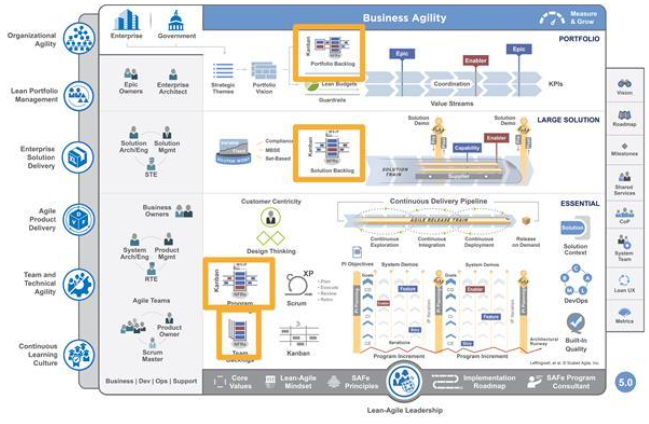
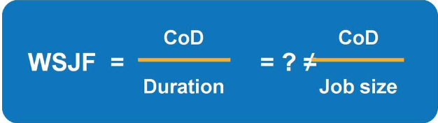

# Preparing Architecture for PI Planning

[TOC]

## Learning objectives
At the end of this lesson you should be able to:
  * Contribute to the Program Backlog
  * Sequence and prioritize work in the Program Backlog
  * Contribute to Solution pre-Pl Planning

## Core PI activities

## What is Program Increment (PI) Planning?

  * Cadence-based Pl Planning is the heartbeat of the Lean Enterprise
  * Two days every 8 - 12 weeks (10 weeks is typical)
  * Everyone attends (in person if at all possible) Product Management owns Feature priorities
  * Agile Teams own Story planning and high-level estimates
  * Architect/Engineering and UX work as intermediaries for governance , interfaces , and dependencies

[Video Link](https://youtu.be/ZZAtl7nAB1M)

More at:

* [Program Increment](https://www.scaledagileframework.com/program-increment/)

## Pl Planning readiness during Innovation and Planning Iteration

Innovation and Planning (IP) Iteration timeline

## Contribute to the Program Backlog

### What's in a backlog?

There is a backlog at each level of SAFe .

* Portfolio backlogs contain Epics and Enablers
* Large Solution Backlogs contain Capabilitiesand Enablers
* Program Backlogs contain Features and Enablers
* Team Backlogs contain Stories and Enablers

The items in these backlogs result from research activities and active collaboration with various stakeholders-Customers ,Business Owners, Product Management , Product Owners , System and Solution Architects/Engineering , and more.

### What are Epics?

An [Epic](https://www.scaledagileframework.com/epic/) is a container for a Solution development initiative large enough to require analysis, the definition of a minimum viable product (MVP), and financial approval before implementation.

Implementation occurs over multiple Program Increments (Pis) and follows the Lean startup 'build-measure-learn' cycle.

### What are Capabilities?

A Capability is a higher-level Solution behavior that typically spans multiple ARTs.

* Maintained in the Solution Backlog, which is overseen by Solution Management
* Prioritized using weighted shortest job first ([WSJF](https://www.scaledagileframework.com/wsjf/))
* Written to include a benefit hypothesis and acceptance criteria
* Structured to fit within a single Pl
* Split into Features for implementation

More at:

* [Features and Capabilities](https://www.scaledagileframework.com/features-and-capabilities/)

### What are Features?

A Feature is a service that fulfills a stakeholder need.

* A Feature includes a benefit hypothesis and acceptance criteria.
* Features are sized or split as necessary to be delivered by a single ART in a Pl
* Product Management is responsible for business Features in the Program Backlog
* System Architects often own Enabler Features

### Architects contribute to Features and Capabilities

Architects often contribute by:
- Identifying measurable benefits and Metrics
- Gauging architectural impact
- Determining acceptance criteria
- Defining non-functional requirements (NFRs)
- Participating in backlog prioritization

**Feature**: In-service software update
**Acceptance Criteria**:

- Nonstop routing availability
- Automatic and manual update support 
- Rollback capability
- Support through existing admin tools
- All enabled services are running after the update

### What are Enablers?

**Enablers** support the activities needed to extend the Architectural Runway to provide future business functionality.

- Captured in backlogs at all levels of the Framework (as Enabler Epics , Enabler Capabilities , Enabler Features , and Enabler Stories)
- Created and managed by System Architect/Engineering
- Are managed in backlogs and are subject to: 
  - Estimating
  - Visibility and tracking
  - Work in process (WIP) limits
  - Feedback
  - Presentation of results

### Types of Enablers

Enablers come in different forms and exist at all levels in SAFe.
- **Infrastructure** - Build , enhance, and automate development , testing, and deployment environments
- **Exploration** - Research, prototyping, evaluating Solution alternatives
- **Architecture** - Build the Architectural Runway, proof-of-concept
- **Compliance** - Schedule and manage specific compliance events or activities

### NFRs can begin as Enablers

*NFRs are often initially realized by Enablers then constrain all future work in the backlog.*

Many Enablers fix existing problems with the Solution (such as performance, scalability and reliability issues).

### SAFe backlog item hierarchy

The SAFe requirements model describes how the backlog is composed

**Learn more**: [SAFe requirement model](https://www.scaledagileframework.com/safe-requirements-model/)

>  “Essentially, all models are wrong, but some are useful.”
>
> ― George E.P. Box

## Sequence and prioritize work in the Program Backlog

### Sequence Features with weighted shortest job first

- Give preference to jobs with shorter duration and higher cost of delay (CoD)
- Use weighted shortest job first to prioritize and sequence Enablers
- WSJF embodies these principles:
  - Take an economic view
  - Ignore sunk costs
  - Make financial choices continuously
  - Use decision rules to decentralize decision-making and control

### Calculate WSJF with relative estimating

- In order to calculate WSJF , teams need to estimate cost of delay and duration
- For duration , use job size as a quick proxy for duration
- Relative estimating is a quick technique to estimate job size and relative value
- WSJF stakeholders : Business Owners , Product Managers , Product Owners , and Architects

### Additional cost of delay considerations

- User and business value
  - Increased customer satisfaction
  - Increased end-user productivity
  - Increased revenue
  - Reduced costs
- Time criticality
  - Driven by market events and rhythms
  - Driven by regulatory or other critical deadlines
- Risk reduction and opportunity enablement (RR&OE)
  - Increased customer satisfaction
  - Increased end-user productivity
  - Increased revenue
  - Reduced costs

### WSJF prioritization

- Use modified Fibonacci numbers (1, 2, 3, 5, 8, 13, 20) for each component of cost of delay and job size.
- Complete one column at a time.
- Start by picking the smallest item and giving it a "1," then size the others relative to that one.
- There must be at least one "1" in each column.
- Calculate W SJF for each Feature. The higher the WSJF value , the higher the priority.

### Using Job Costs as a Proxy for Epic Duration 

When estimated job costs are known, it may be a better proxy than estimated job size for the denominator in WSJF. These costs are often known in the later stages of the portfolio Kanban after the Lean business case has been created. As these big jobs are selected for implementation, a more refined WSJF using estimated costs as the proxy, or better yet—an estimate for the duration—is warranted. 

When estimated job costs are used for the denominator of WSJF, normalizing the cost of these epics simplifies the math. To do this, give the lowest estimated epic cost a ‘1.0,’ then divide the cost of subsequent epics by the lowest value (e.g., 1.5/ 0.5 = 3.0), as shown in below.

### Ensure all concerns are reflected in backlog formulation

Architects/Engineering work with Product Management, Product Owners, and other Architects.

###  Lack of trust can lead to poor architecture investment

### Capacity allocation helps balance priorities

- Create balance between immediate and long-term value delivery
- Continuously invest in the Architectural Runway
- Provide time for exploration of requirements and design for future PIs

### Capacity allocation

As the System Architect for your ART, you need new infrastructure implemented this Pl to support a Feature in an upcoming Pl.

You also have concerns that the infrastructure, if not architected properly, will not meet the performance requirements of the Solution.

However, your ART's Product Manager has committed a significant amount of functionality to the business for this Pl without considering the capacity required to deliver the infrastructure work.

## Contribute to Solution pre-Pl Planning

### Prepare with Solution pre- and post-Pl Planning meetings

- Pre-meeting helps build an aligned plan for the next Pl and match Solution demand to ART capacities
- Post -meeting reviews , recaps , communicates , and provides feedback
- Typically attended by: 
  - Customers
  - STE
  - Solution Architects /Engineers 
  - Solution Train stakeholders 
  - Select ART representatives 
  - Solution Management
  - Supplier

### Solution Train pre-PI Planning during IP iteration
Innovation and Planning (IP) Iteration timeline

[Innovation and planning iteration](https://www.scaledagileframework.com/innovation-and-planning-iteration/)

### Solution Train pre-Pl Planning during IP iteration
Innovation and Planning (IP) Iteration timeline

### Solution pre-Pl Planning agenda
**Goals**:
Align Product Managers , System Architects , and other ART stakeholders to a common Vision

Prepare content for ART Pl Planning

**Input**:
Results of the previous Pl execution
Outcomes of the Solution Demo or, if delayed , ART demos

Roll-up of the program predictability measure to the Solution Train

**Output**:
A set of Features for every ART 

Updates to the ART Visions

[PI Planning](https://www.scaledagileframework.com/pi-planning/)

## Lesson review

In this lesson, you:
- Explored contributing to the Program Backlog
- Discovered how to sequence and prioritize work in the Program Backlog
- Reviewed how Architects contribute to Solution pre-Pl Planning

## Referecence

### Backlog structure and management

[Team backlog](https://www.scaledagileframework.com/team-backlog/)

[Program and Solution Backlog](https://www.scaledagileframework.com/program-and-solution-backlogs/)

[Portfolio Backlog](https://www.scaledagileframework.com/portfolio-backlog/)

[Backlog structure and management](https://www.scaledagileframework.com/enterprise-backlog-structure-and-management/)

Backlog item types

Team level

Program level

### Weighted shorted job first

[WSJF](https://www.scaledagileframework.com/wsjf/)

### Backlog

[Program and solution backlog](https://www.scaledagileframework.com/program-and-solution-backlogs/)

### Innovation and planning iteration - IP

[Innovation and planning iteration](https://www.scaledagileframework.com/innovation-and-planning-iteration/)

### Kanban

[Team kanban](https://www.scaledagileframework.com/team-kanban/)

[Program and Solution Kanban](https://www.scaledagileframework.com/program-and-solution-kanbans/)

[Portfolio Kanban](https://www.scaledagileframework.com/portfolio-kanban/)

[Applied Enterprise Workflow with SAFe Portfolio kanban](https://www.scaledagileframework.com/guidance-article-applied-enterprise-workflow-with-the-safe-portfolio-kanban/)

