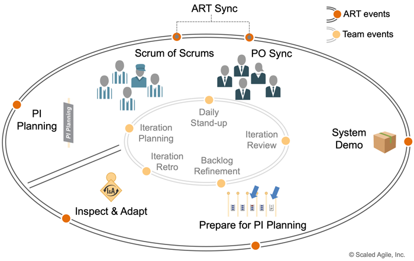
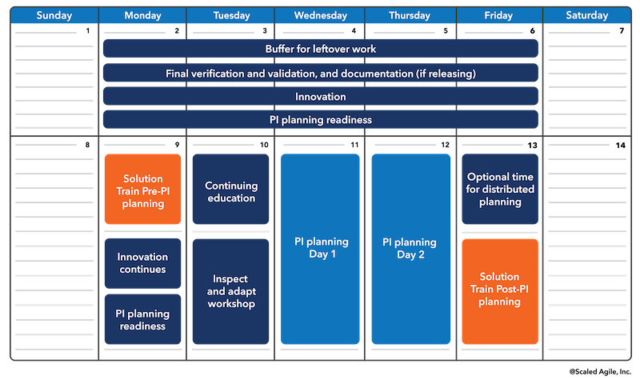
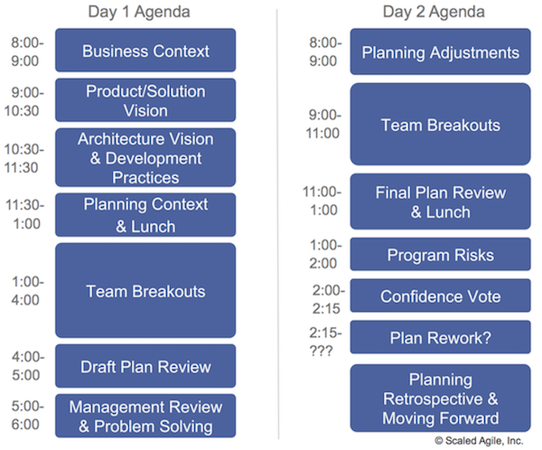
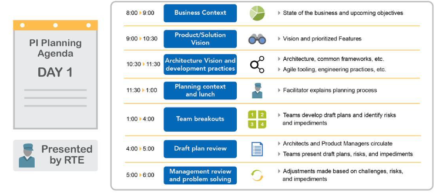
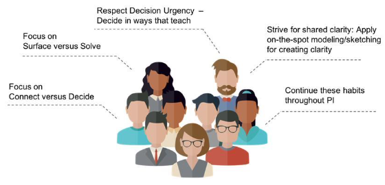
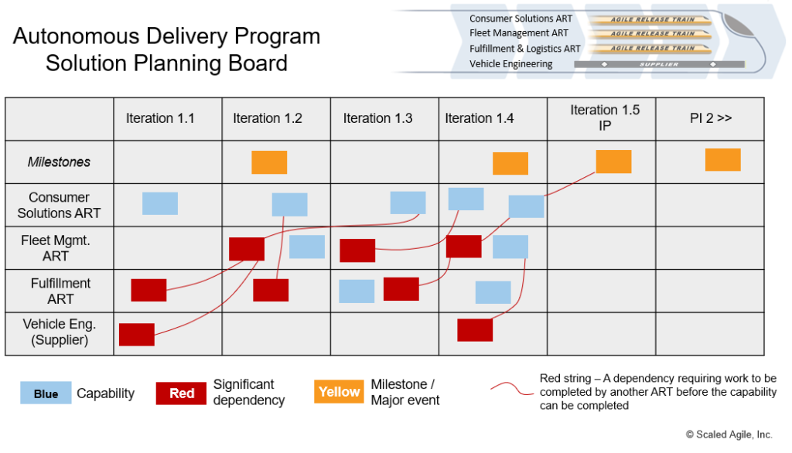
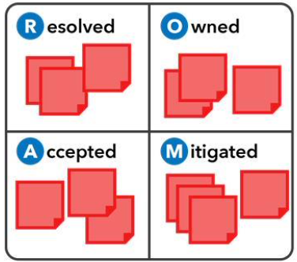
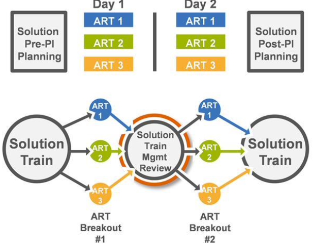
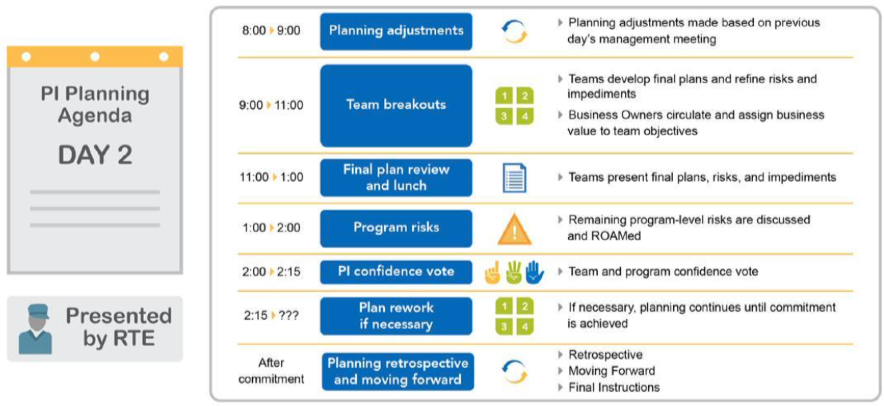

# Coordinating Architecture throughout PI Planning

[TOC]

## Learning Objectives

At the end of this lesson you should be able to:

- Contribute to PI Planning
- Contribute to management review and problem-solving
- Contribute to Solution post-PI Planning

### Core PI Activities

A Program Increment (PI) is a timebox during which an Agile Release Train (ART) delivers incremental value in the form of working, tested software and systems. PIs are typically 8 – 12 weeks long. The most common pattern for a PI is four development Iterations, followed by one Innovation and Planning (IP) Iteration.

[Program Increment](https://www.scaledagileframework.com/program-increment/)

### Pl Planning timing
Pl Planning typically falls within the Innovation and Planning (IP) Iteration. in the image below PI planning occurs during PI planning Day 1 and PI Planning Day 2 boxes.

[PI Planning](https://www.scaledagileframework.com/pi-planning/)

### The role of the Architect in Pl Planning
During Pl Planning, System Architects typically:
- Present the architecture Vision
- Elaborate on NFRs and desired implementation patterns and practices
- Ensure consistency and alignment of the implementation approach in team breakouts
- Support ROAM (resolved, owned, accepted, or mitigated) activity by identifying and/or owning program risks.

### Pl Planning agenda

Pl Planning is usually a two-day event, with everyone on the ART meeting in person to plan the next Program Increment.

## Contribute to Pl Planning

### Pl Planning Day 1 details
Architects play a role in all of the Day 1 events.

### Partner with Agile Teams

- During breakouts , teams are developing draft plans and identifying risks and impediments
- Architects and Product Managers should circulate among teams and collaborate to answer questions

### Show architecture dependencies on the program board

- Look for architectural dependencies
- Limit architecture WIP
  - Don't be a bottleneck
- Plan to collaborate during the PI
  - Defer decisions to the last responsible moment
- Partner with the System Team
  - System Team often executes a significant amount of Enabler work

### Identify and resolve risks in real time
- Be on constant watch for program risks (be an exemplar)
- Anticipate dependencies across these domains:
  - Functions : dev, test, infrastructure , info-sec, compliance, etc.
  - Teams: Agile Teams, shared services, ARTs, Suppliers, etc.
- Surface risks immediately
- Assist with working them to resolution
  - Team-level risks are resolved by the owning team
  - Program-level risks are ROAMed

### Reference

- [Program Increment](https://www.scaledagileframework.com/program-increment/)
- [PI Planning](https://www.scaledagileframework.com/pi-planning/)
- [Pre and Post PI Planning](https://www.scaledagileframework.com/pre-and-post-pi-planning/)

## Contribute to management review and problem- solving

### Management review and problem-solving

At the end of Day 1, Program Management meets to make adjustments to scope and objectives based on the day's planning. Common questions during management review include :

- What did we just learn?
- Do we need to adjust Vision? Scope? Staffing?
- Are there any bottlenecks?
- Will this Solution be viable over the long term?
- Does the plan balance business and IT objectives?
- What decisions must we make between now and tomorrow to close any gaps?

### Solution Train management review and problem-solving

After the ARTs finish their management review and problem-solving during Pl Planning , the STE facilitates a
similar meeting for the Solution Train. Common questions during Solution Train
management review and problem-solving include :

- What new dependencies have we identified?
- Where do we need to adjust Vision? Scope? Staffing?
- Are there any bottlenecks?
- Do any Capabilities need to be de-scoped?
- What decisions must we make between now and tomorrow to close any gaps?

### Pl Planning Day 2 details

Architects play a role in all Day 2 events.

### Reference

- [Solution Train](https://www.scaledagileframework.com/solution-train/)

- [Product and Solution Management](https://www.scaledagileframework.com/product-and-solution-management/)

This PI (outer loop) PDCA learning cycle is represented in SAFe by the following ART events and activities: 

Plan – The PI Planning event is the plan step of the cycle. 

Do – PI execution is the do 

Check – The System Demo is the check 

Adjust – The Inspect and Adapt (I&A) is the adjust

