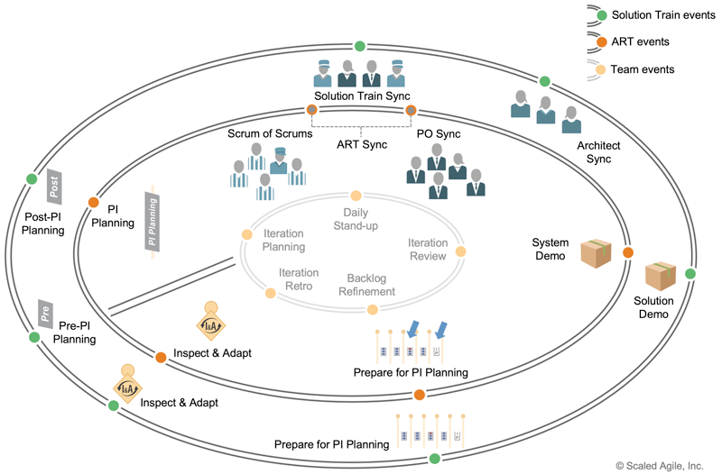
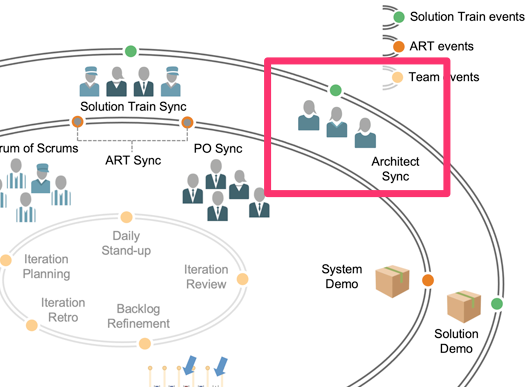
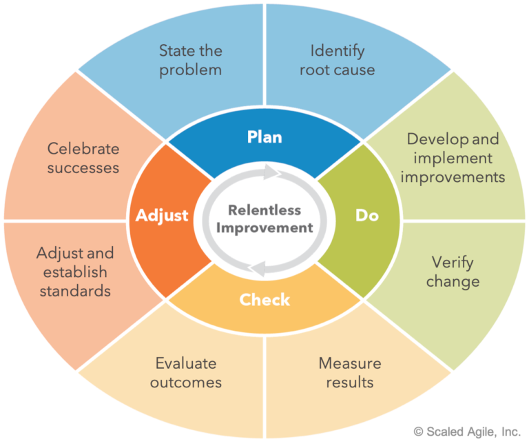

# Supporting Continuous Delivery during PI Execution

[TOC]

## Learning Objectives

At the end of this lesson you should be able to:
- Guide architecture and Continuous Delivery throughout the PI
- Prepare for Iteration Reviews and System and Solution Demos
- Relentlessly improve through Inspect and Adapt (l&A)

## Guide architecture and Continuous Delivery throughout the PI

### SAFe events for Solution Trains, ARTs, and teams

### Architects actively participate during the PI

Active participants throughout the PI, Architects are involved in:
- Working with Agile Teams
- Supporting Enabler development
- Attending Iteration Reviews
- Attending System Demos
- Continuously refining the architectural backlog
- Demonstrating continuous delivery of Architectural Runway through Iteration Reviews, System Demos , and Solution Demos
- Shepherding the architecture Vision all the way through implementation

### Architects support continuous improvement

- Refactoring the architecture
  - Loose coupling, cloud migration, performance tuning
- Upgrading and evolving tools, environments, and infrastructure - CI/CD, test automation, infrastructure-as-code, auto-scaling
- Continuous delivery of Architectural Runway
- Delivering and evaluating minimum viable architecture
- Researching trends and applying emerging technology

### Architect Sync

Architects, tech leads, and key subject matter experts attend the Architect Sync to:
- Align on strategy
- Design Architectural Runway
- Resolve risks and impediments
- Share news and knowledge
- Swarm on problems and solutions

## Prepare for Iteration Reviews and System and Solution Demos

### Value is demonstrated frequently

* Iteration Review

  - **WHAT**: A critical method for gathering immediate , Team-level feedback
  - **WHEN** : Occurs every iteration
  - **WHO** : Presented by the teams doing the work to teammates and interested stakeholders , which may include other teams
  - **SHOWS** : Real measure of team value, velocity , and progress during the prior iteration

* System Demo

  - **WHAT**: Gathering immediate, system- level feedback of full system in representative staging environment WHEN : Occurs every iteration and
at end of PI (as part of Inspect and Adapt)
  - **WHO** : Presented by the ART Product Manager and Product owners . Attended by sponsors , stakeholders , and customers
  - **SHOWS** : Real measure of system value, velocity , and progress to learn and adjust

* Solution Demo
  - **WHAT**: A 'pull' event to ensure ARTs and suppliers create integrated and tests solutions demonstrated in as true a solution context as possible
  - **WHEN** : Occurs at least at the end of each PI, more frequently if possible
  - **WHO** : Presented by the ARTs. Attended by suppliers, sponsors , stakeholders, and customers
  - **SHOWS** : Results of the combined development efforts of multiple ARTs which determines the future course of action for investment in the Solution

### Architect's role during Iteration Review

Demonstrate intentional architecture
* Architects are team members who demo their work
* Demo spikes , story-level Enablers and NFRs
* Gather feedback from the team and stakeholders
* Gauge value of architectural decisions Attend other Iteration Reviews
* Architects are stakeholders of Agile Teams
* Observe how design is emerging
* Gauge alignment with Solution Intent
* Provide feedback

### Is the architecture enabling or hindering Feature delivery?

* Help prepare features for System Demo
  - System integration , end-to-end tests , deployment
* Demonstrate Architectural Runway
  - Enabler Features , NFRs , integrated systems
  - Benefits to business and the Continuous Delivery Pipeline
  - Gather feedback to continually improve system architecture
* Provide feedback on implemented system
  - Verify alignment with Solution Intent

### Architect's role during Solution Demo

Is the architecture enabling or hindering Capability delivery?
* Help prepare capabilities for Solution Demo
  - Solution integration , end-to-end tests , deployment
* Demonstrate Solution architecture
  - Enabler Capabilities , NFRs , benefits
* Provide feedback on the implemented Solution
  - Verify alignment with Solution Intent

## Relentlessly improve through Inspect and Adapt

### Inspect and Adapt

**Three parts**:
1. The PI System Demo
2. Quantitative measurement
3. The problem-solving workshop

**Attendees**: Teams and stakeholders

**Time box**: 3 - 4 hours per PI

### Quantitative measurements
The program predictability measure gauges the performance of the ART.
* Each team's planned vs actual business value is rolled up to the program level in the program predictability measure.
* Architects are typically
accountable for the business value scores of Enabler Features and Capabilities.
* Architects should also measure value delivered against architecture hypotheses.

### PI Retrospective
* Brief team problem-identification activity (less than 30 minutes)
* Goal is to identify systemic issues that need to be addressed
  - Typically program-level in scope
  - May be identified by multiple teams
* Teams contribute their own views of the problem
* Identified issues 'seed' the problem-solving workshop

### The problem-solving workshop

Roles and teams on the train work together to identify systemic issues that can be brought into the Program Backlog in the upcoming PI.

## Lesson review
In this lesson you:
* Explored how Architects guide architecture and Continuous Delivery throughout the PI
* Explored how Architects prepare for Iteration Reviews and System and Solution Demos
* Examined how to relentlessly improve through Inspect and Adapt
