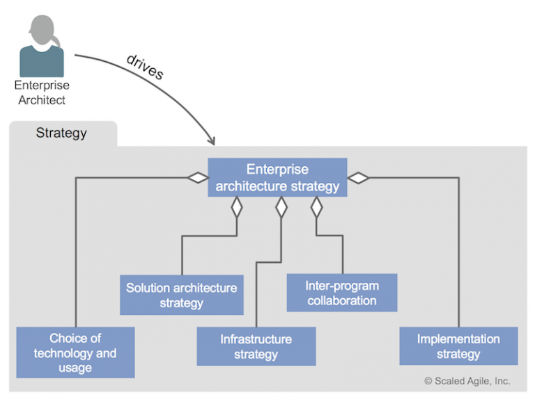
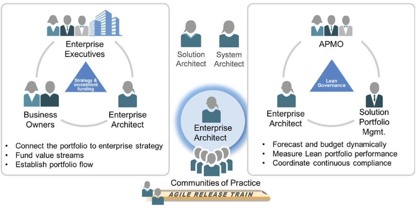
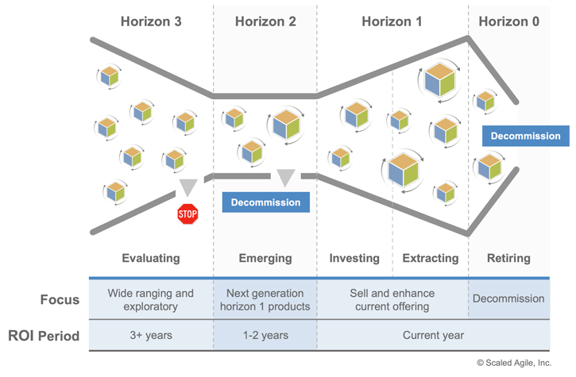
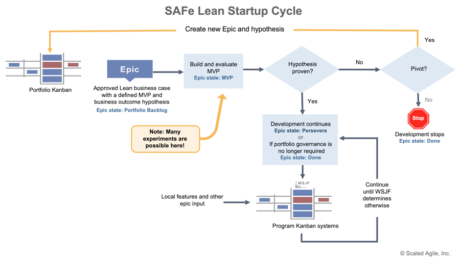
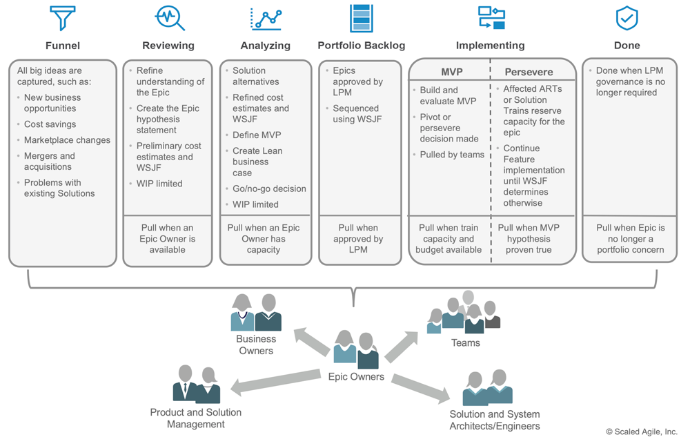

# Supporting New Strategic Themes and Value Streams

[TOC]

## Learning Objectives

At the end of this lesson you should be able to:
* Align architecture to Enterprise strategy
* Evolve the Solution Portfolio
* Contribute Enabler Epics to the Portfolio Kanban
* Coordinate across Value Streams

## Align architecture to Enterprise strategy

### Enterprise Architects as stewards of corporate strategy

* Collaborate with Lean Portfolio Management to provide a high- level, all-inclusive Vision of Enterprise Solutions and development initiatives.
* Champion and communicate Strategic Themes and other key business drivers throughout the organization.
* Strongly influence SAFe portfolio budgets, architecture Vision and Solution Roadmaps.

###  Enterprise Architects as collaborators

### Enterprise Architects as influencers

The decisions of Enterprise Architects impact the entire Value Stream. Therefore, it is critical that they apply Lean-Agile thinking.

### Enterprise Architects as strategic planners

* Strategic Themes drive the portfolio canvas, which guides decision-making throughout the Value Stream
* These decisions must reflect a balance between business strategy and technology strategy
* Enterprise Architects are specially equipped to advise on the optimal balance

## Evolve the Solution Portfolio

### Lean Budget Guardrails Align Strategic Investment with Strategy

* Architecture influences investment decisions
* EA should participate in
  - Guiding investments by horizon
  - Optimizing value and Solution integrity with capacity allocation
  - Approving significant initiatives
  - Continuous Business Owner engagement

### Use investment horizons to manage obsolescence and technical debt

* Take an economic view
 - Which systems are assets? Which are liabilities?
 - Where is the value (present , future)?
* Maintain technical currency by:
  - Balancing legacy and emerging technology
  - Protecting and maintaining core systems
  - Leveraging new technology to innovate, commoditize , and scale
  - Retiring old systems to simplify the architecture and control costs

### Application portfolio rationalization

Continually evolve the technology ecosystem by:

* Exploring trends in emerging technology
* investing in valuable technology experiments
* Supporting and extending core technology assets
* Minimizing technology duplication and "shadow IT"
* Retiring technology that no longer delivers appreciable value
* Minimizing technology licensing and support costs
* Managing the technology portfolio through mergers and acquisitions cycles

## Contribute Enabler Epics to the Portfolio Kanban

### Managing large shifts in technology:

* Large shifts can include moving to the Cloud, moving off a mainframe, or moving to continuous releases
* Large shifts often start with Enabler Epics, which may require Lean business cases
* Architects typically own Enabler Epics
* Architects can advise on what patterns and techniques to use:
  * Decommission, evolve, migrate, refactor
  * Strangulation patterns, multi-tenancy, selective deployment, disaster recovery

###  Foster innovation with the Lean Startup cycle Each Epic:

* Has an outcome hypothesis
* Defines a minimum viable product (MVP )

### Govern Epic flow with the Portfolio Kanban system

### The role of the Epic Owner

* Manages the flow of an individual Epic through the Portfolio Kanban system
* Defines the Epic, its minimum viable product (MVP), and Lean business case, and (when approved) facilitates implementation

### Preparing an Epic

* Work with stakeholders and subject matter experts to define the Epic, its hypothesis statement, MVP, and cost of delay
* Work with development teams to size the Epic and provide input for economic prioritization
* Guide the Epics through the funnel, review, and analyzing stages of the Portfolio Kanban system
* Present the Epic and associated Lean business case to Lean Portfolio Management (LPM) for a go/no-go decision

### Epics deserve a Lean business case

Investment in Epics is a serious matter; analysis and informed decision-making are crucial.

* 'Just the right amount' of analysis
* Avoid over-specificity
* Define the outcomes hypothesis
* Understand implementation impact
* Develop incremental implementation strategy
* Gain approval
* Not a specification!

## Coordinate across Value Streams

### Coordinate across Value Streams

* Solution Portfolio Management
    - Has the overall responsibility for guiding a portfolio to a set of integrated Solutions
* Enterprise Architect
    - Provides technical guidance for the long-term evolution of the technologies and platforms and the larger nonfunctional requirements
* Agile Program Management Office (APMO)
    - Typically responsible for supporting decentralized , but efficient , program execution (along with the STEs and RTEs)

### EA role in Value Stream coordination

* Enterprise Architects (EAs) provide technical guidance for the long- term evolution of the technologies and platforms and the larger nonfunctional requirements for the portfolio Solution set (security, compliance, performance, and more)
* EAs also foster flow by identifying runway needed to minimize the impact of cross-cutting dependencies

## Lesson review

In this lesson you:

* Reviewed how to align architecture to Enterprise strategy
* Examined how to evolve the Solution Portfolio
* Discovered how to contribute Enabler Epics to the Portfolio Kanban
* Examined how to coordinate across Value Streams
