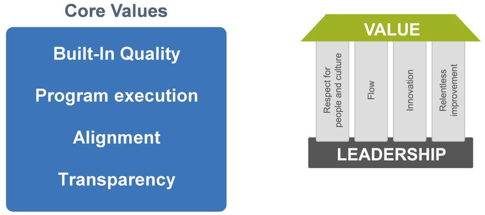
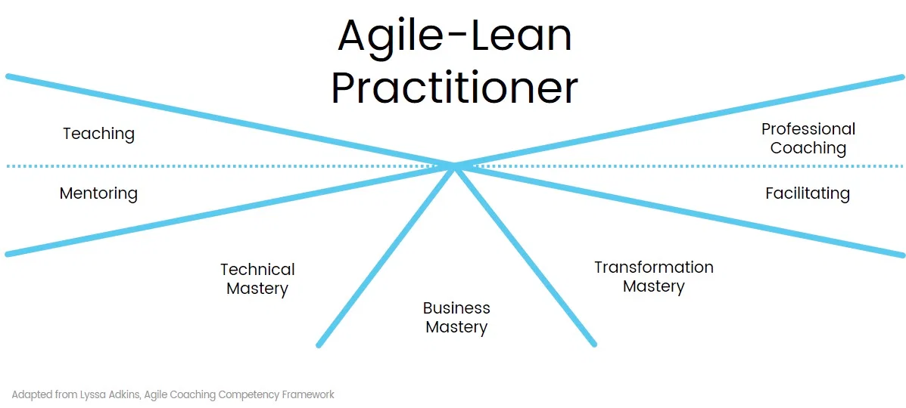
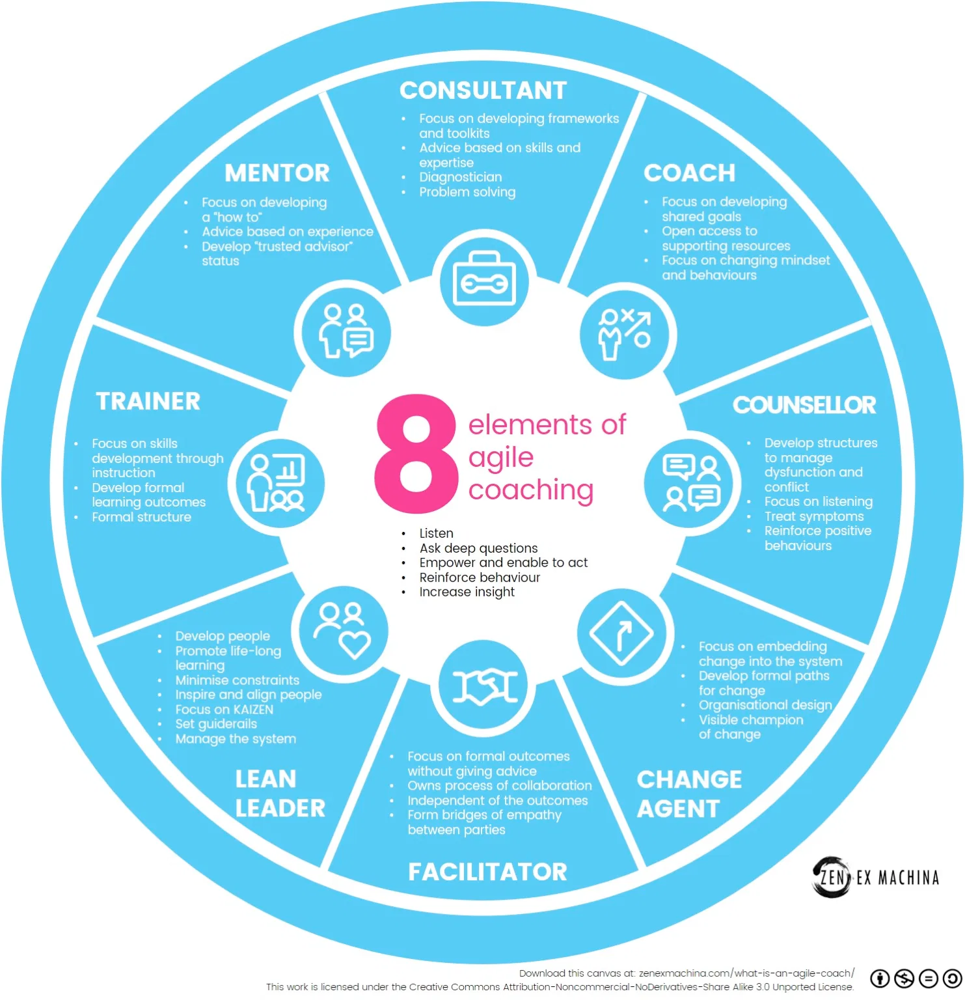

# Leading as an Architect during a Lean-Agile Transformation

[TOC]

##  Learning objectives

At the end of this lesson you should be able to:

* Describe how Architects perform as Lean-Agile leaders
* Describe how to lead the transition to Agile architecture during a transformation
* Develop an action plan to support your organization's transformation

## Describe how Architects perform as Lean-Agile leaders

### SAFe Core Values and House of Lean

The SAFe Core Values and House of Lean guide Lean-Agile leaders.

### Lean-Agile Leadership
* Lean-Agile Leadership anchors the foundation of SAFe
* Lean-Agile leaders shape the culture and environment by:
* Acting as Lean-thinking manager-teachers
* Reinforcing SAFe Core Values and principles
* Adopting and exhibiting a Lean-Agile Mindset

###  Coach like an agilist

* Mentor – Develops ‘how to’s.
* Consultant – Develops frameworks.
* Coach – Develops and sets shared goals.
* Counsellor – Develops structures to resolve disfunction.
* Change Agent – Focusses on embedding change.
* Facilitator – Supports a formal outcome without advice.
* Lean Leader – Develops people.
* Trainer/Teacher – Focuses on skills development through instruction.

Reference: [the 8 elements of agile coaching](https://zenexmachina.com/the-8-elements-of-agile-coaching/)

## Describe how to lead the transition to Agile architecture during a Transformation

### Conway's Law

> Organizations which design systems ... are constrained to produce designs
> which are copies of the communication structures of these organizations .
>
> Melvin Conway

* Architecture mimics team structure
* If teams are large and disorganized, the architecture will be too
* If teams are loosely coupled and Agile, the architecture will be too
* Evolve team structure and architecture together

### Steps for successful change

1. Establish a sense of urgency
2. Create a powerful guiding coalition
3. Develop the vision and strategy
4. Communicate the vision
5. Empower employees for broad-based action
6. Generate short-term wins
7. Consolidate gains and produce more wins
8. Anchor new approaches in the culture

### Collaborate with the Lean-Agile Center of Excellence (LACE)

* Lean-Agile transformations are typically led by a team that is committed to delivering improvements
* Transformation teams should include executive participants
* Architects should provide technical guidance to and collaborate with the LACE

> A guiding coalition that operates as an effective team can process more
> information , more quickly. It can also speed the implementation of new
> approaches because powerful people are truly informed and committed to key
> decisions.
>
> John Kotter

## Develop an action plan to support your organization's transformation

##  Lesson review

In this lesson, you:

* Described how Architects perform as Lean-Agile leaders
* Outlined how Architects lead the transition to Agile architecture during a transformation
* Developed an action plan for supporting your Lean-Agile transformation
